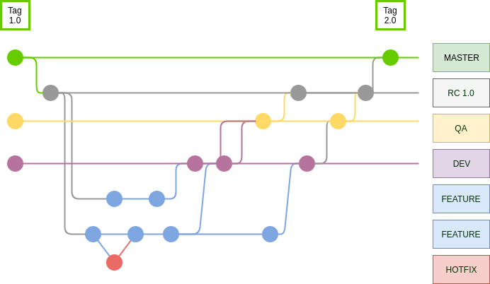

### Flow with a single Release candidate

#### Steps:

1. Create a branch from master
2. Finalize tasks
3. Send to Developer branch (make all tests)
4. Send to QA branch (Just if thats ok in developer)
5. Fix bugs (if exists)
6. Generate release from release candidate branch
7. Merge release with master
8. Generate tag

#### Attention:

* All new features from the sprint must be created from release candidate.
* If exist a bug in master and he are fixed, when it happens is necessary update all branchs with master (if necessary), avoiding conflict and others.
* Hotfix in sprint are fixeds in branch origins.
* PR are opened to release candidate
* After Pull Request its valid, then merge branch with QA and notify Analisty.
* When sprint are completed, generate a release, merge with master and generate a tag.

### QA branch are like a clone from last RC, then attention! Ever sent RC to QA, never overwrite with other version.

`Simple like jeep painel.`

**By the way, keep RC updated with master branch.**

> Finish! Enjoy ;)