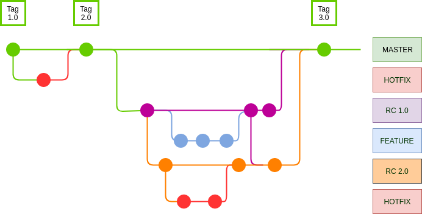

### Flow with a single Release candidate

#### Steps:

1. Create a branch from master
2. Finalize tasks
3. Send to Developer branch (make all tests)
4. Send to QA branch (Just if thats ok in developer)
5. Fix bugs (if exists)
6. Generate release from release candidate branch
7. Merge release with master
8. Generate tag

#### Attention:

> When existe more than a release candidate (RC) then is necessary more attention!

* Last release has all features from previous RC, example:
  - Existing two RC, RC 1.0 and RC 2.0, when a feature is sent to RC 1.0 is necessary merge with RC 2.0 too. But, when a feature is sent to RC 2.0, this feature it is not merged with RC 1.0.
  - Remember, RC 2.0 are created from RC 1.0, then RC 1.0 must be contains only yours features.
  - When RC 1.0 is merged with master, RC 2.0 logically will have RC 1.0 featurs, simple :)
* All new features from the sprint must be created from release candidate.
* If exist a bug in master and he are fixed, when it happens is necessary update all branchs with master (if necessary), avoiding conflict and others.
* Hotfix in sprint are fixeds in branch origins.
* PR are opened to release candidate
* After Pull Request its valid, then merge branch with QA and notify Analisty.
* When sprint are completed, generate a release, merge with master and generate a tag.

### QA branch are like a clone from last RC, then attention! Never send preivous RC overwrite QA branch. Follow right flow, merge previous RC with last RC and sent to QA, just it!

Simple like jeep painel.

**By the way, keep RC updated with master branch.**

> Finish! Enjoy ;)